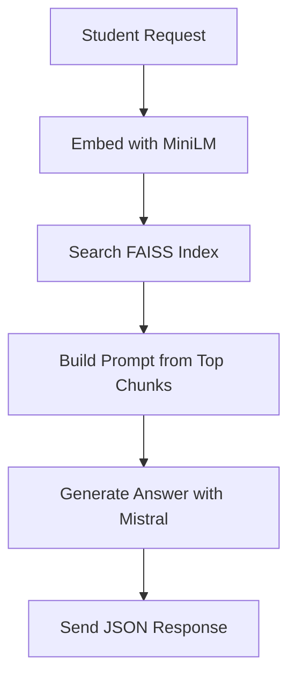

# 🧭 Camp Navigator: RAG Assistant (Flask + FAISS + Akash-Ready)

Welcome to the **Artemis Camp Navigator**, a no-touch, student-friendly Retrieval-Augmented Generation (RAG) assistant built for deployment on the decentralized Akash cloud.  
This project teaches how to combine **vector search**, **open-source LLMs**, and **educational safety** into one deploy-once Flask API.

[](https://creativecommons.org/licenses/by/4.0/)

---

## 🧠 What Is This?

This app is a **read-only assistant** that:
- Responds to questions about camp material
- Generates daily mission directives for students
- Requires no maintenance once deployed (🔥 “no-touch”)

It uses:
- 🧱 **Flask** – Lightweight, secure backend
- 🔍 **FAISS** – Fast vector similarity search
- 🤖 **Mistral 7B** – Hugging Face-hosted open LLM
- 📦 **Akash** – Decentralized GPU deployment platform

---

## 📁 Folder Structure

```
my-flask-rag-app/
├── app/
│   ├── __init__.py           # Flask app factory
│   ├── routes.py             # Two API endpoints
│   └── rag_utils.py          # FAISS + LLM inference
├── docs/                     # Markdown and text sources for RAG
├── faiss.index               # Auto-generated FAISS index
├── embeddings.json           # Metadata for indexed chunks
├── templates/
│   └── index.html            # Simple landing page
├── prep_index.py             # Script to create the FAISS index
├── requirements.txt
├── Dockerfile
├── wsgi.py
├── deploy.yaml               # Akash SDL definition
├── deploy.sh                 # Bash deployment helper
├── README.md                 # You're reading it!
└── README_DEPLOY.md          # Full Akash deployment instructions
```

---

## 🚀 How to Use (Production)

This is designed for **Akash** deployment. You do **not** need to host it yourself.

1. Edit `deploy.yaml` with your Akash wallet + Docker image
2. Push the image to DockerHub
3. Run `deploy.sh` to launch

Once deployed, students can query:
```
https://YOUR-AKASH-URL/api/daily_directive?student_id=student05&token=pass05
https://YOUR-AKASH-URL/api/ask?student_id=student05&token=pass05&q=What is FSM?
```

---

## 🔐 Security Notes

- Auth is hardcoded for `student01` to `student50`
- Each must use their pre-assigned `token`
- Model and embeddings are **read-only**
- All dangerous operations removed (uploads, retrains, etc.)

---

## 🧠 How It Works (Architecture)



---

## 🧪 Development (Optional)

To rebuild the index from local docs:

```bash
python prep_index.py
```

---

## 📜 License

This project is licensed under **Creative Commons Attribution 4.0 International (CC BY 4.0)**. You are free to **share**, **remix**, and **build upon** this work—even commercially—as long as you give proper credit.

---

**Built with ❤️ by CodeBreakers / Next Shift Consulting**

Join the mission → [CodeBreakers Manifesto](terms/CodeBreakers_Manifesto.md)
